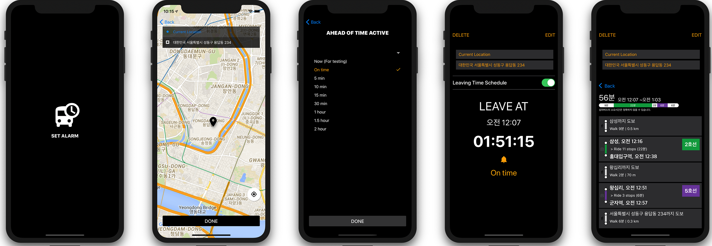

# The Last Subway

This application provides the last public transit route and push alarms on leaving time.



## Features

- Set up a destination in Map (Google Maps, Geocoding API)

- Set up alarm push notifications (Expo Push Notifications, Android Channels)

- Provides the last public transit route (Google Directions API)

- Shows timers by leaving time

- Provides editing and deleting destination location and alarm times

## Requirements
- Android physical devices or simulators

- iOS only physical devices for push notifications

## Prerequisites

- Go to the [Google API Console](https://console.developers.google.com/)


- Enable 4 APIs [[how to link]](https://support.google.com/googleapi/answer/6158841?hl=en)

  * Maps SDK for Android
  * Maps SDK for iOS
  * Directions API
  * Geocoding API

- Get an API key `<YOUR GOOGLE API KEY>` [[how to link]](https://developers.google.com/maps/documentation/javascript/get-api-key)

## Installation

```
git clone https://github.com/letsdoyi/the-last-subway-client.git

cd the-last-subway-client

touch credentials.js

open credentials.js // Copy and paste the code below in this file

npm install

expo start

```

### `credentials.js`

Copy and paste the code below in this file

Replace `<YOUR GOOGLE API KEY>` with `<GOOGLE API KEY>` from [Prerequisites](#Prerequisites)

```
export default credentials = {
  GOOGLE : {
    APIKEY : <GOOGLE API KEY>
  }
}
```

## Tech Skills

- JavaScript (ES2015+)

- Expo, React Native

- React for component-based-architechture

- React Navigation

- Redux for state management

- HTTP request using Axios

## Test

- Jest and Enzyme for Unit test

## Version and Schedule Control

- Git, Github

- Trello for managing scheluled tasks

## Challenges

- First Experiences With React Native: Different Structures To React

  Connecting React Native with Redux was challenging. In React, Redux Store is connected with an App container and delivers props and states to it. However, in React Native, linked screens by navigator, delivering props and states needs different structure. it is solved by using React Navigation. App container sends props to App Navigator made by React Navigation.

- Short Time Period, 2 weeks: Schedule Management and Finding Alternatives

  To meet a deadline, I found alternatives or held time-consuming problems over when faced with them although I'd tested APIs and codes in advance of App development.

  For instance, React Native Google Place Autocomplete set in the South Korea area was not working in my Application. I substituted searching function using Place autocomplete for moving a marker and setting destination and held the problem over.

  Another example is about public data portal open API (realtime station arrival API). The API data for calculating the last public transit time is not stable with a server error. I got transit information between the first and last train time using Google Direction API instead of unstable the API. From these experiences, I could practice managing my schedules on my level and finding several alternatives.

## Things To do

- [ ] Adding Place Autocomplete for improved location search

- [ ] Managing user's favorite locations

- [ ] Adding arrival time setting for providing accurate information

- [ ] Not stopping timer after leaving time BugFix

- [ ] Refactoring for code reusability

- [ ] End To End Test
